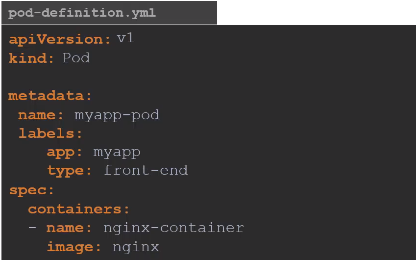

# 1. Kubernetes Services

Take me to [Video Tutorial](https://kodekloud.com/topic/services-3/)

- [1. Kubernetes Services](#1-kubernetes-services)
  - [1.1. Introduction](#11-introduction)
  - [1.2. External Communication](#12-external-communication)
  - [1.3. Service Types](#13-service-types)
    - [1.3.1. NodePort](#131-nodeport)
    - [1.3.2. ClusterIP](#132-clusterip)
    - [1.3.3. LoadBalancer](#133-loadbalancer)
- [2. K8s Reference Docs:](#2-k8s-reference-docs)

In this section we will take a look at **`services`** in kubernetes

## 1.1. Introduction

- Kubernetes Services enables communication between various components within and outside of the application.

  
  
**Let's look at some other aspects of networking;**

## 1.2. External Communication

- How do we as an **`external user`** access the **`web page`**?

  - From the node (Able to reach the application as expected)
  
    
    
  - From outside world (This should be our expectation, without something in the middle it will not reach the application)
  
    
   
    
 ## 1.3. Service Types
 
 There are 3 types of service types in kubernetes
 
   
 
 ### 1.3.1. NodePort

- Where the service makes an internal POD accessible on a POD on the NODE.

```yaml
apiVersion: v1
kind: Service
metadata:
  name: myapp-service
spec:
  types: NodePort
  ports:
  - targetPort: 80
    port: 80
    nodePort: 30008
```


      
- To connect the service to the pod
  
```yaml
apiVersion: v1
kind: Service
metadata:
  name: myapp-service
spec:
  types: NodePort
  ports:
  - targetPort: 80
    port: 80 
    nodePort: 30008 # valid range for node port = 30000 to 32767
  selector: # this specifies what pod needs to connect to
    app: myapp # these are from the labels section of the pod definition file
    type: front-end
  ```
Note: Between `targetPort`, `port` and `nodePort`, the only mandatory field is `port`. If targetPort is not defined the same port as `port` is used. If nodePort is not defined a valid value (30000-32767) will be automatically assigned.


      
To create the service

```
$ kubectl create -f service-definition.yaml
```

To list the services

```
$ kubectl get services
```

To access the application from CLI instead of web browser

```
$ curl http://192.168.1.2:30008
```


A service with multiple pods: If multiple pods match the specified criteria, the service randomly sends requests to one of them. 


When Pods are distributed across multiple nodes: In this case Kubernetes automatically creates a service that can be used across pods.


     
            
### 1.3.2. ClusterIP

- In this case the service creates a **`Virtual IP`** inside the cluster to enable communication between different services such as a set of frontend servers to a set of backend servers.
    
### 1.3.3. LoadBalancer

- Where the service provisions a **`loadbalancer`** for our application in supported cloud providers.
    
# 2. K8s Reference Docs:
- https://kubernetes.io/docs/concepts/services-networking/service/
- https://kubernetes.io/docs/tutorials/kubernetes-basics/expose/expose-intro/

