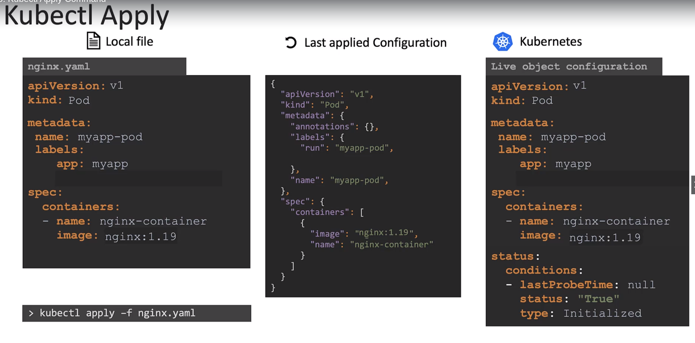
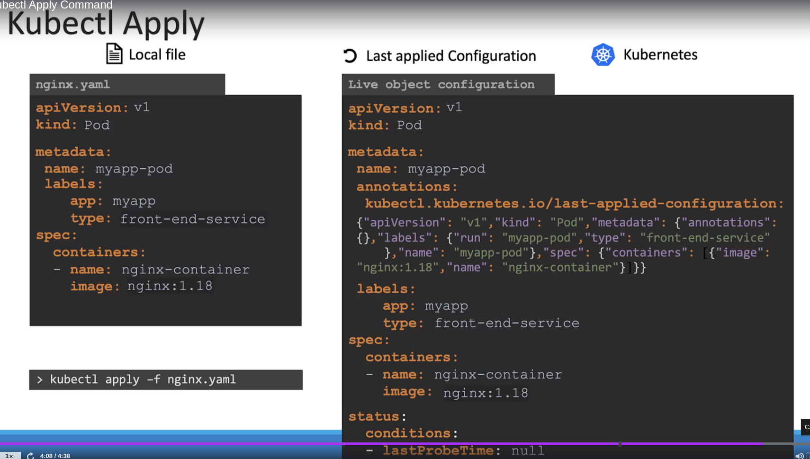

# Certification Tips - Imperative Commands with kubectl <!-- omit in toc -->

Take me to the [Certification tips page](https://kodekloud.com/topic/certification-tips-imperative-commands-with-kubectl/)

- [1. Imperative vs Declarative](#1-imperative-vs-declarative)
  - [1.1. Comparing the two approaches](#11-comparing-the-two-approaches)
  - [1.2. Imperative vs Declarative in the Kubernetes world](#12-imperative-vs-declarative-in-the-kubernetes-world)
    - [1.2.1. Imperative](#121-imperative)
    - [1.2.2. Declarative](#122-declarative)

# 1. Imperative vs Declarative

## 1.1. Comparing the two approaches

A simple example to compare imperative vs Declarative is to imagine going to a destination in a taxi. With imperative commands, you would be giving individual directions (turn right, turn left, etc..). But with Declarative commands, you would instead be telling the taxi driver the location you would like to go to and the driver will take you there.

- Specifying what to do is the declarative approach
- Specifying how to do something is imperative approach

For example, 
let's say we are creating a web server (infrastructure as code);

The imperative approach to do this would be to;
1. Provision a VM by the name 'web-server'
2. Install NGINX on it
3. Edit config file to use port '8080'
4. Edit config file to web path '/var/www/nginx'
5. Load web pages to '/var/www/nginx' from GIT Repo - X
6. Start NGINX server

The declarative approach to do this would be to;

```yaml
VM Name: web-server
Package: nginx
Port: 8080
Path: /var/www/nginx
Code: GIT Repo - X
```

## 1.2. Imperative vs Declarative in the Kubernetes world

### 1.2.1. Imperative

some example imperative commands;

```bash
# Create Objects
kubectl run --image=nginx nginx
kubectl create deployment --image=nginx nginx
kubectl expose deployment nginx --port 80

# Update Objects
kubectl edit deployment nginx 
kubectl scale deployment nginx --replicas=5
kubectl set image deployment nginx nginx=nginx:1.18

# Even though we are working with yaml files below, these are still imperative.

# create deployment
kubectl create -f nginx.yaml
# update the live yaml file. Changes are not saved anywhere other than locally
kubectl edit deployment nginx

# Do a change to the yaml file and replace the current deployment. This is still imperative. This fails if the object doesn't already exist in the current deployment.
kubectl replace -f nginx.yaml

kubectl replace --force -f nginx.yaml

kubectl delete -f nginx.yaml
```

### 1.2.2. Declarative

```bash
# Create objects

# the apply command is intelligent enough to create an object if it already doesn't exist and change the existing object if there's one already existing.
kubectl apply -f nginx.yaml

# multiple config files
kubectl apply -f /path/to/config-files

# Update objects
kubectl apply -f nginx.yaml # note this is the same command
```

`kubectl apply` command considers both the local yaml file, last applied configuration(saved internally as a json file) and the live object configuration saved as a yaml file.

The json file is mainly useful for situations where the local yaml file has some fields removed from the previous apply command. This helps kubectl identify these and remove them as necessary on the live object.

The last applied configuration is actually saved inside the live object configuration with json format. This is saved only when the kubectl apply command is used. Therefore you should not mix imperative and declarative commands when managing your cluster to avoid issues.





More information can be found [here](https://kubernetes.io/docs/tasks/manage-kubernetes-objects/declarative-config/)


