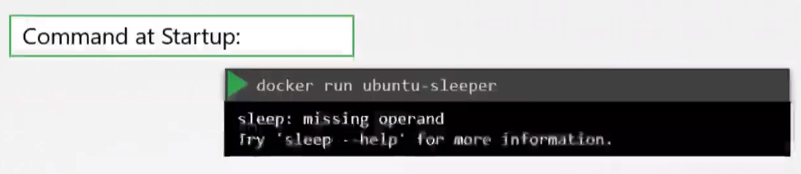

# Commands and Arguments in Docker
  - Take me to [Video Tutorial](https://kodekloud.com/topic/commands-and-arguments-in-docker/)
  
In this section, we will take a look at commands and arguments in docker

- To run a docker container
  ```
  $ docker run ubuntu
  ```
- To list running containers
  ```
  $ docker ps 
  ```
- To list all containers including that are stopped
  ```
  $ docker ps -a
  ```
  
  
  
#### Unlike virtual machines, containers are not meant to host operating system.
- Containers are meant to run a specific task or process such as to host an instance of a webserver or application server or a database server etc.

  
  
  
#### How do you specify a different command to start the container?
- One Option is to append a command to the docker run command and that way it overrides the default command specified within the image.
  ```
  $ docker run ubuntu sleep 5
  ```
- This way when the container starts it runs the sleep program, waits for 5 seconds and then exists. How do you make that change permanent?
  
  
  
- There are different ways of specifying the command either the command simply as is in a shell form or in a JSON array format.
 
  
  
- Now, build the docker image
  ```
  $ docker build -t ubuntu-sleeper .
  ```
- Run docker container
  ```
  $ docker run ubuntu-sleeper
  ```
  
  
  
## Entrypoint Instruction
- The entrypoint instruction is like the command instruction as in you can specify the program that will be run when the container starts and whatever you specify on the command line.

- Let's say you want to change the sleep duration in a container that is built just to sleep. 
  - If the sleep duration was specified as `CMD sleep 5` you would need to override the whole command to change the sleep duration (i.e. `docker run ubuntu-sleeper sleep 10`)
  - But if the `ENTRYPOINT` is specified as sleep, you can just specify the time duration as a parameter to specify the time slept. `docker run ubuntu-sleeper 10`  


- But in the second case where you just have the entrypoint defined, if you don't specify the time period when calling `docker run ubuntu-sleeper` you'll get an error.



- This is a situation where you'll use both `ENTRYPOINT` and `CMD` instruction. Note that both needs to be specified in a json format for this to work. This way, if you do `docker run ubuntu-sleeper` it'll still run with the parameter specified in `CMD` and if you want to override the default duration you can easily do so with `docker run ubuntu-sleeper 10`

```Dockerfile
FROM Ubuntu
ENTRYPOINT ["sleep"]
CMD ["5"]
```

- What if you really wanted to change the `ENTRYPOINT` in the above image? In this case you can do `docker run --entrypoint sleep2.0 ubuntu-sleeper 10` (here we are overriding the `sleep` command with `sleep2.0`)


#### K8s Reference Docs
- https://docs.docker.com/engine/reference/builder/#cmd
