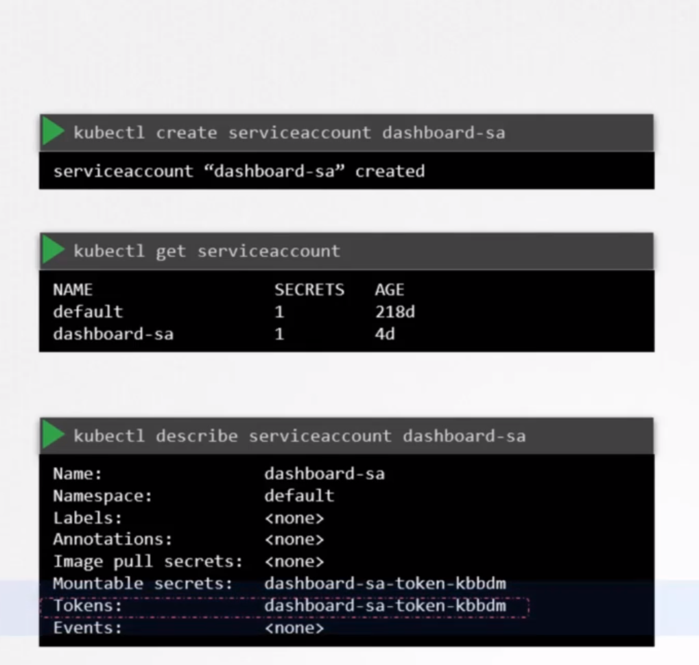
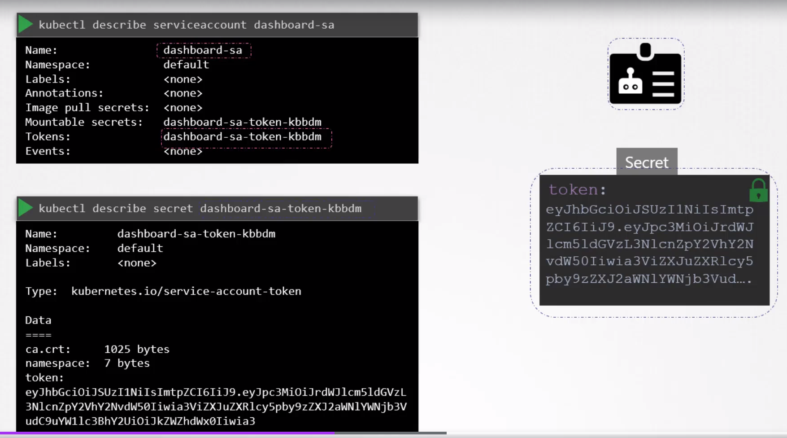
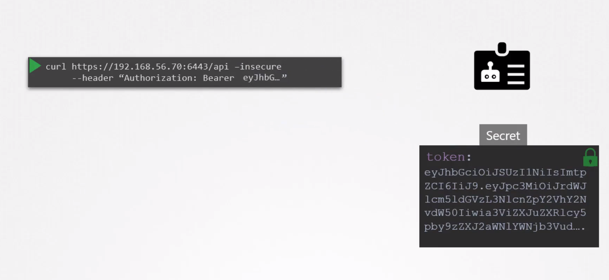
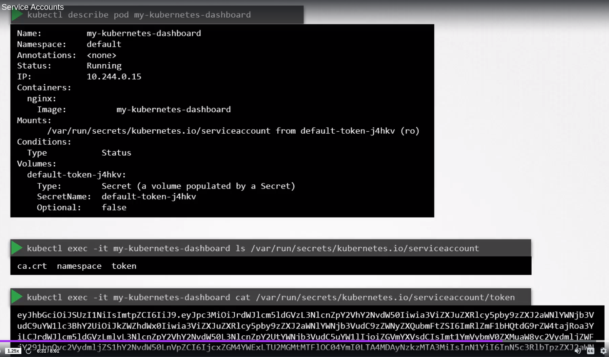

# Service accounts <!-- omit in toc -->

- [1. Introduction](#1-introduction)
  - [Create, get, view service account](#create-get-view-service-account)


# 1. Introduction

- User accounts are usually used by users and service accounts are used by applications

## Create, get, view service account

```bash
kubectl create serviceaccount <service account name>

kubectl get serviceaccount

kubectl describe serviceaccount <service account name>
```



Service account has a token associated with it. When a service account is created a token is created and stored inside a secret object. The secret object is then linked to the service account.





- Create service account and assign the correct permissions using the RBAC mechanisms and then export the key and use it to configure the third party app to authenticate with the kubernetes api.
- If the 3rd party application is hosted in the Kubernetes cluster itself the whole process of exporting the token can be made simple by automatically mounting the service token secret as a volume inside the pod hosting the 3rd party application.

- There's a default service account that exists for every namespace. Each namespace has it's own default service account.
- When a pod is created this default SA is mounted automatically at `/var/run/secrets/kubernetes.io/serviceaccount`. You can set `automountServiceAccountToken: false` to prevent this.



- This default SA has very limited permissions. It can only run basic kubernetes api queries

- You can add a custom service account in `serviceAccountName` field in the pod definition file. Remember you can't edit the service account in a running pod. You would need to destroy and recreate the pod. You can however edit the SA in a deployment as edits to deployments triggers the pods to be recreated. 
- You can add the serviceaccountname directly to the deployment as: 

```yaml
apiVersion: apps/v1
kind: Deployment
metadata:
  name: web-dashboard
  namespace: default
spec:
  replicas: 1
  selector:
    matchLabels:
      name: web-dashboard
  strategy:
    rollingUpdate:
      maxSurge: 25%
      maxUnavailable: 25%
    type: RollingUpdate
  template:
    metadata:
      creationTimestamp: null
      labels:
        name: web-dashboard
    spec:
      serviceAccountName: dashboard-sa
      containers:
      - image: gcr.io/kodekloud/customimage/my-kubernetes-dashboard
        imagePullPolicy: Always
        name: web-dashboard
        ports:
        - containerPort: 8080
          protocol: TCP   
```