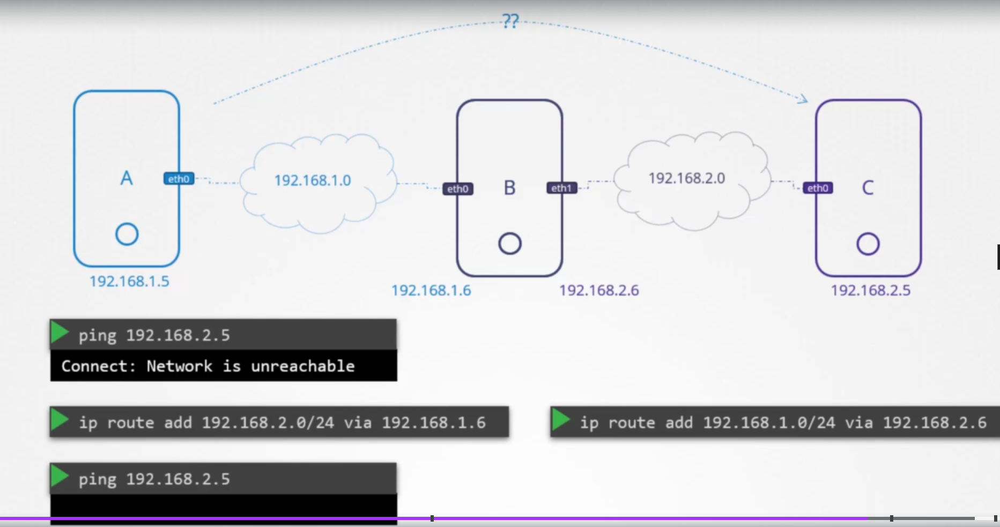

# Pre-requisite Switching Routing Gateways <!-- omit in toc -->

  - Take me to [Lecture](https://kodekloud.com/topic/pre-requisite-switching-routing-gateways-cni-in-kubernetes/)

In this section, we will take a look at **Switching, Routing and Gateways**

- [1. Switching](#1-switching)
- [2. Routing](#2-routing)
- [3. Gateways](#3-gateways)
  - [Making a linux host act as a router](#making-a-linux-host-act-as-a-router)

# 1. Switching

- To see the interface on the host system

```
$ ip link
```
- To see the IP Address interfaces.

```
$ ip addr
```


# 2. Routing

- To see the existing routing table on the host system.

```
$ route
```
```
$ ip route show
or
$ ip route list
```

- To add entries into the routing table.

```
$ ip route add 192.168.1.0/24 via 192.168.2.1
```


# 3. Gateways

- To add a default route.
```
$ ip route add default via 192.168.2.1
```

## Making a linux host act as a router



Let's say we have 3 machines, A, B, C and want B to act as a router. As shown in the picture above, B would be connected to both networks while A and C are in separate networks. 

In order to fascilitate communication between A and C, we'll need to do the following:

- On A:
  - `ip route add 192.168.2.0/24 via 192.168.1.6`

- On B:
  - Allow forwarding packets from one interface to another: 
    - `echo 1 > /proc/sys/net/ipv4/ip_forward`
    - To make this value permanent across reboots you need to modify `/etc/sysctl.conf` file line: `net.ipv4.ip_forward = 1`

- On C: 
  - `ip route add 192.168.1.0/24 via 192.168.2.6`

- To check the IP forwarding is enabled on the host.
```
$ cat /proc/sys/net/ipv4/ip_forward
0

$ echo 1 > /proc/sys/net/ipv4/ip_forward
```

- Enable packet forwarding for IPv4.
```
$ cat /etc/sysctl.conf

# Uncomment the line
net.ipv4.ip_forward=1
```

- To view the sysctl variables.
```
$ sysctl -a 
```

- To reload the sysctl configuration.
```
$ sysctl --system
```


