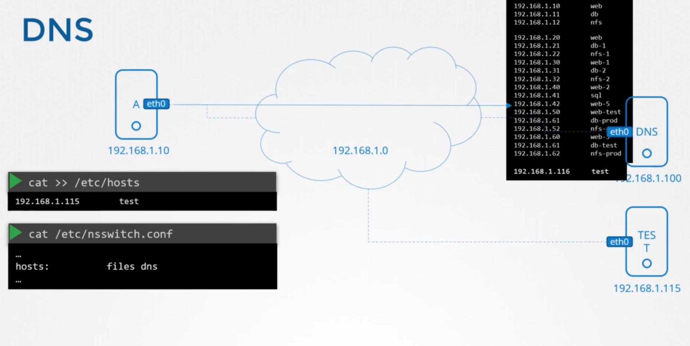
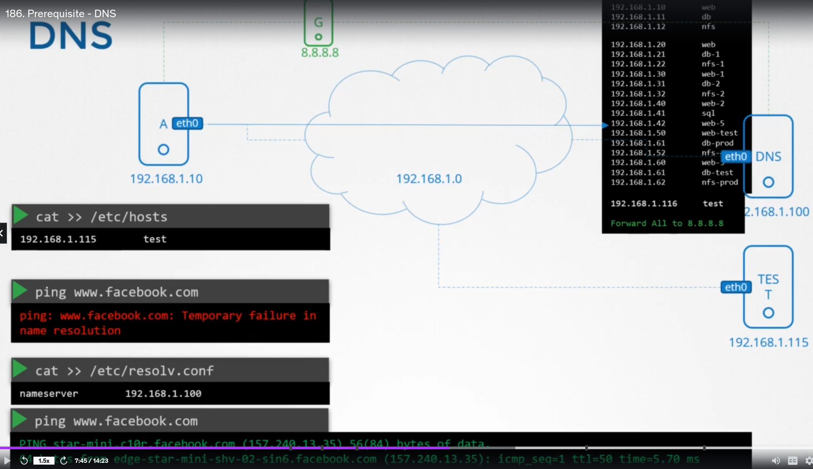
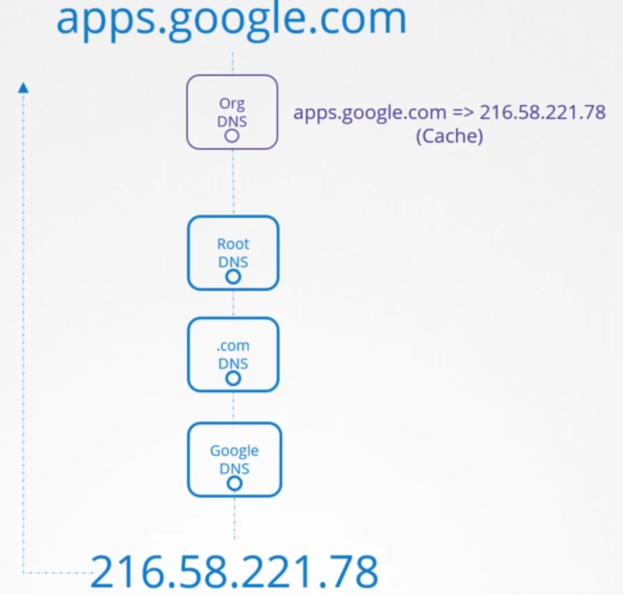
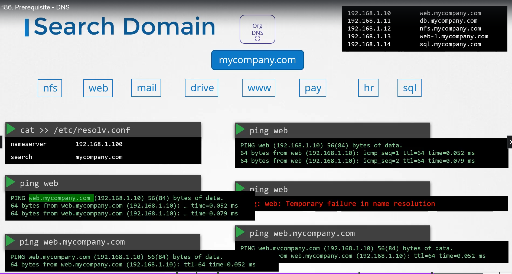

# Pre-requisite DNS <!-- omit in toc -->

  - Take me to [Lecture](https://kodekloud.com/topic/prerequsite-dns/)

In this section, we will take a look at **DNS in the Linux**

- [1. Name Resolution](#1-name-resolution)
- [2. DNS](#2-dns)
  - [2.1. Domain Names](#21-domain-names)
  - [2.2. Search Domain](#22-search-domain)
  - [2.3. Record Types](#23-record-types)
- [3. Networking Tools](#3-networking-tools)
  - [3.1. nslookup](#31-nslookup)
  - [3.2. dig](#32-dig)


## 1. Name Resolution 

- With help of the `ping` command. Checking the reachability of the IP Addr on the Network.

```
$ ping 172.17.0.64
PING 172.17.0.64 (172.17.0.64) 56(84) bytes of data.
64 bytes from 172.17.0.64: icmp_seq=1 ttl=64 time=0.384 ms
64 bytes from 172.17.0.64: icmp_seq=2 ttl=64 time=0.415 ms

```
- Checking with their hostname

```
$ ping web
ping: unknown host web

```
- Adding entry in the `/etc/hosts` file to resolve by their hostname.

```
$ cat >> /etc/hosts
172.17.0.64  web


# Ctrl + c to exit
```
- It will look into the `/etc/hosts` file.

```
$ ping web
PING web (172.17.0.64) 56(84) bytes of data.
64 bytes from web (172.17.0.64): icmp_seq=1 ttl=64 time=0.491 ms
64 bytes from web (172.17.0.64): icmp_seq=2 ttl=64 time=0.636 ms

$ ssh web

$ curl http://web
```

## 2. DNS

- Every host has a DNS resolution configuration file at `/etc/resolv.conf`.

```
$ cat /etc/resolv.conf
nameserver 127.0.0.53
options edns0
```

- To change the order of dns resolution, we need to do changes into the `/etc/nsswitch.conf` file.

```bash
$ cat /etc/nsswitch.conf

hosts:          files dns
networks:       files

```

`files` in the above refers to the dns hosts file. `dns` refers to the dns server.



- If it fails in some conditions.

```
$ ping wwww.github.com
ping: www.github.com: Temporary failure in name resolution

```

- Adding well known public nameserver in the `/etc/resolv.conf` file.

```
$ cat /etc/resolv.conf
nameserver   127.0.0.53
nameserver   8.8.8.8
options edns0
``` 
```
$ ping www.github.com
PING github.com (140.82.121.3) 56(84) bytes of data.
64 bytes from 140.82.121.3 (140.82.121.3): icmp_seq=1 ttl=57 time=7.07 ms
64 bytes from 140.82.121.3 (140.82.121.3): icmp_seq=2 ttl=57 time=5.42 ms

```

And since we already have a dns server configured, instead of adding `8.8.8.8` (or other dns server) to individual `/etc/resolv.conf` file, we can add it to our dns server instead.



### 2.1. Domain Names


when trying to find the ip address for an address such as `www.google.com` the organizational dns first goes to the Root DNS which then goes to `.com` DNS and then goes to `Google DNS`. The organizational dns can choose to cache this result for a period of time (eg 30 seconds, 1 minute) so that it doesn't have to go through this whole process all the time. 



### 2.2. Search Domain

Let's say our company has several subdomains such as `nfs`, `web`, `mail`, etc. In order for an outside party to reach these we can add the corresponding addresses to our company dns server as shown in the image below. (i.e. an outside dns server would come all the way to our company dns server using the `mycompany.com` address)


But since we changed our internal dns, we can no longer call our internal websites using just `web`, `nfs`, `drive` etc. addresses. We need to specify the full path even when trying to reach from our local network. (i.e. we need to say `web.mycompany.com` instead of just saying `web`).

In order to still have this functionality, we can add a `search` domain to our `/etc/resolv.conf` file. This way we can reach `web.mycompany.com` using both, `web` and `web.mycompany.com` addresses. You can also provide additional search queries;

```bash
search    mycompany.com prod.mycompany.com
```




### 2.3. Record Types

`A` records: ip to host name
`AAAA` records: ipv6 to host name
`CNAME` records: name to name mappings


## 3. Networking Tools

- Useful networking tools to test dns name resolution.

### 3.1. nslookup 

```
$ nslookup www.google.com
Server:         127.0.0.53
Address:        127.0.0.53#53

Non-authoritative answer:
Name:   www.google.com
Address: 172.217.18.4
Name:   www.google.com
```

Note: `nslookup` does not consider entries in the local `/etc/hosts` file.

### 3.2. dig

```
$ dig www.google.com

; <<>> DiG 9.11.3-1 ...
;; Got answer:
;; ->>HEADER<<- opcode: QUERY, status: NOERROR, id: 8738
;; flags: qr rd ra; QUERY: 1, ANSWER: 1, AUTHORITY: 0, ADDITIONAL: 1

;; OPT PSEUDOSECTION:
; EDNS: version: 0, flags:; udp: 65494
;; QUESTION SECTION:
;www.google.com.                        IN      A

;; ANSWER SECTION:
www.google.com.         63      IN      A       216.58.206.4

;; Query time: 6 msec
;; SERVER: 127.0.0.53#53(127.0.0.53)
```
