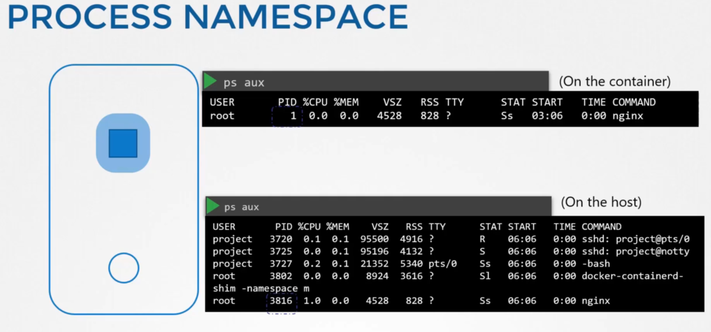
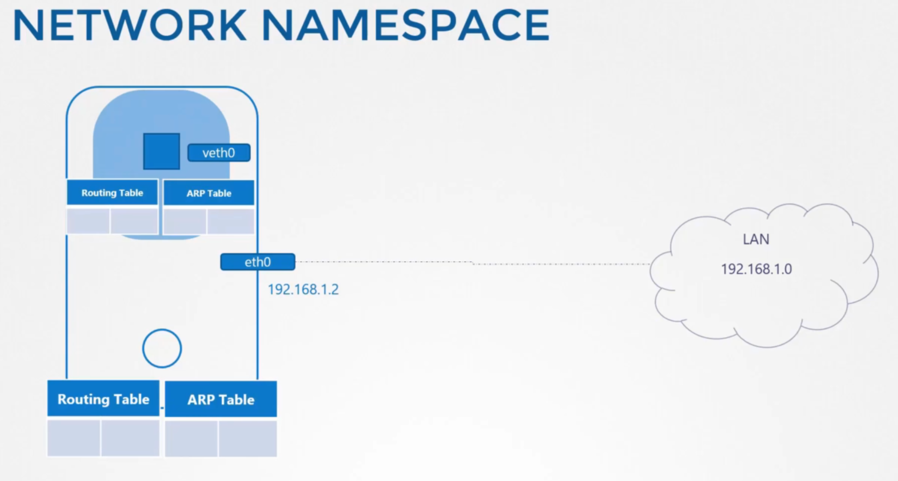
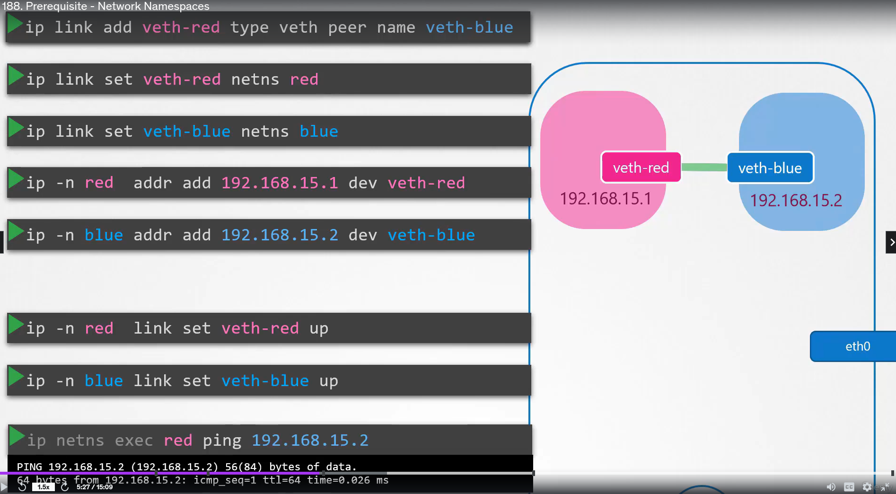
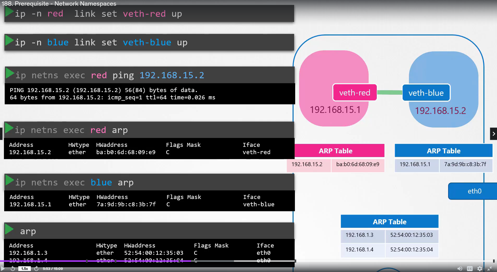
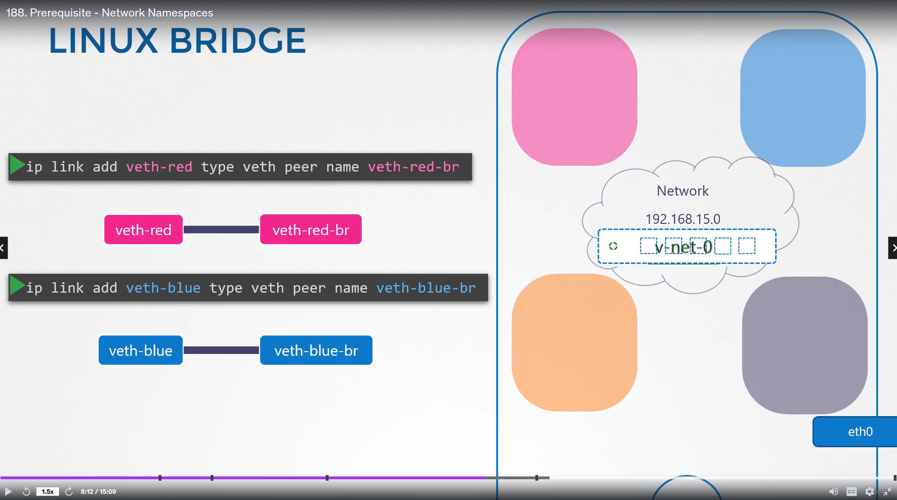
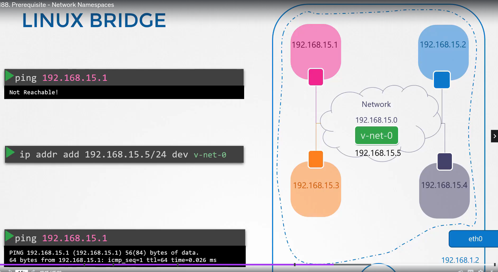

# Pre-requisite Network Namespaces

  - Take me to [Lecture](https://kodekloud.com/topic/prerequsite-network-namespaces/)

In this section, we will take a look at **Network Namespaces**


## Process Namespace

> On the container
```
$ ps aux      
```

> On the host
```
$ ps aux 

```



## Network Namespace

```
$ route
```

```
$ arp
```



## Create Network Namespace

```
$ ip netns add red

$ ip netns add blue
```
- List the network namespace

```
$ ip netns
```

## Exec in Network Namespace

- List the interfaces on the host

```
$ ip link
```

- Exec inside the network namespace

```
$ ip netns exec red ip link
1: lo: <LOOPBACK> mtu 65536 qdisc noop state DOWN mode DEFAULT group default qlen 1000
    link/loopback 00:00:00:00:00:00 brd 00:00:00:00:00:00

$ ip netns exec blue ip link
1: lo: <LOOPBACK> mtu 65536 qdisc noop state DOWN mode DEFAULT group default qlen 1000
    link/loopback 00:00:00:00:00:00 brd 00:00:00:00:00:00
```
- You can try with other options as well. Both works the same.
```
$ ip -n red link
1: lo: <LOOPBACK> mtu 65536 qdisc noop state DOWN mode DEFAULT group default qlen 1000
    link/loopback 00:00:00:00:00:00 brd 00:00:00:00:00:00
```

## ARP and Routing Table

> On the host
```
$ arp
Address                  HWtype  HWaddress           Flags Mask            Iface
172.17.0.21              ether   02:42:ac:11:00:15   C                     ens3
172.17.0.55              ether   02:42:ac:11:00:37   C                     ens3
```

> On the Network Namespace
```
$ ip netns exec red arp
Address                  HWtype  HWaddress           Flags Mask            Iface

$ ip netns exec blue arp
Address                  HWtype  HWaddress           Flags Mask            Iface
```


> On the host 
```
$ route
```

> On the Network Namespace
```
$ ip netns exec red route
Kernel IP routing table
Destination     Gateway         Genmask         Flags Metric Ref    Use Iface

$ ip netns exec blue route
Kernel IP routing table
Destination     Gateway         Genmask         Flags Metric Ref    Use Iface
```

## Virtual Cable

- To create a virtual cable
```
$ ip link add veth-red type veth peer name veth-blue
```

- To attach with the network namespaces
```
$ ip link set veth-red netns red

$ ip link set veth-blue netns blue
```

- To add an IP address
```
$ ip -n red addr add 192.168.15.1/24 dev veth-red

$ ip -n blue addr add 192.168.15.2/24 dev veth-blue
```

- To turn it up `ns` interfaces
```
$ ip -n red link set veth-red up

$ ip -n blue link set veth-blue up
```



- Check the reachability 
```
$ ip netns exec red ping 192.168.15.2
PING 192.168.15.2 (192.168.15.2) 56(84) bytes of data.
64 bytes from 192.168.15.2: icmp_seq=1 ttl=64 time=0.035 ms
64 bytes from 192.168.15.2: icmp_seq=2 ttl=64 time=0.046 ms

$ ip netns exec red arp
Address                  HWtype  HWaddress           Flags Mask            Iface
192.168.15.2             ether   da:a7:29:c4:5a:45   C                     veth-red

$ ip netns exec blue arp
Address                  HWtype  HWaddress           Flags Mask            Iface
192.168.15.1             ether   92:d1:52:38:c8:bc   C                     veth-blue

```

- Delete the link. (When you delete a link on one end, the link on the other end gets deleted automatically since they are a pair.)
```
$ ip -n red link del veth-red
```

> On the host
```
# Not available
$ arp
Address                  HWtype  HWaddress           Flags Mask            Iface
172.16.0.72              ether   06:fe:61:1a:75:47   C                     ens3
172.17.0.68              ether   02:42:ac:11:00:44   C                     ens3
172.17.0.74              ether   02:42:ac:11:00:4a   C                     ens3
172.17.0.75              ether   02:42:ac:11:00:4b   C                     ens3
```



## Linux Bridge

- Create a network namespace

```
$ ip netns add red

$ ip netns add blue
``` 
- To create a internal virtual bridge network, we add a new interface to the host
```
$ ip link add v-net-0 type bridge
```
- Display in the host
```
$ ip link
8: v-net-0: <BROADCAST,MULTICAST> mtu 1500 qdisc noop state DOWN mode DEFAULT group default qlen 1000
    link/ether fa:fd:d4:9b:33:66 brd ff:ff:ff:ff:ff:ff
```
- Currently it's down, so turn it up
```
$ ip link set dev v-net-0 up
```
- To connect network namespace to the bridge. Creating a virtual cable
```
$ ip link add veth-red type veth peer name veth-red-br

$ ip link add veth-blue type veth peer name veth-blue-br
```



- Set with the network namespaces
```
$ ip link set veth-red netns red

$ ip link set veth-blue netns blue

$ ip link set veth-red-br master v-net-0

$ ip link set veth-blue-br master v-net-0
```


- To add an IP address
```
$ ip -n red addr add 192.168.15.1/24 dev veth-red

$ ip -n blue addr add 192.168.15.2/24 dev veth-blue
```
- To turn it up `ns` interfaces
```
$ ip -n red link set veth-red up

$ ip -n blue link set veth-blue up
```
- To add an IP address
```
$ ip addr add 192.168.15.5/24 dev v-net-0
```
- Turn it up added interfaces on the host
```
$ ip link set dev veth-red-br up
$ ip link set dev veth-blue-br up
```


> On the host
```
$ ping 192.168.15.1
```



Please watch [8:57 to the end of this video](https://www.udemy.com/course/certified-kubernetes-administrator-with-practice-tests/learn/lecture/14296142#overview) for more info about below commands.

> On the ns
```
$ ip netns exec blue ping 192.168.1.1
Connect: Network is unreachable

$ ip netns exec blue route

$ ip netns exec blue ip route add 192.168.1.0/24 via 192.168.15.5

# Check the IP Address of the host
$ ip a

$ ip netns exec blue ping 192.168.1.1
PING 192.168.1.1 (192.168.1.1) 56(84) bytes of data.

$ iptables -t nat -A POSTROUTING -s 192.168.15.0/24 -j MASQUERADE

$ ip netns exec blue ping 192.168.1.1

$ ip netns exec blue ping 8.8.8.8

$ ip netns exec blue route

$ ip netns exec blue ip route add default via 192.168.15.5

$ ip netns exec blue ping 8.8.8.8
```

- Adding port forwarding rule to the iptables

```
$ iptables -t nat -A PREROUTING --dport 80 --to-destination 192.168.15.2:80 -j DNAT
```
```
$ iptables -nvL -t nat
```

# Troubleshooting

While testing the Network Namespaces, if you come across issues where you can't ping one namespace from the other, make sure you set the NETMASK while setting IP Address. ie: 192.168.1.10/24

```bash
ip -n red addr add 192.168.1.10/24 dev veth-red
```

Another thing to check is FirewallD/IP Table rules. Either add rules to IP Tables to allow traffic from one namespace to another. Or disable IP Tables all together (Only in a learning environment).


