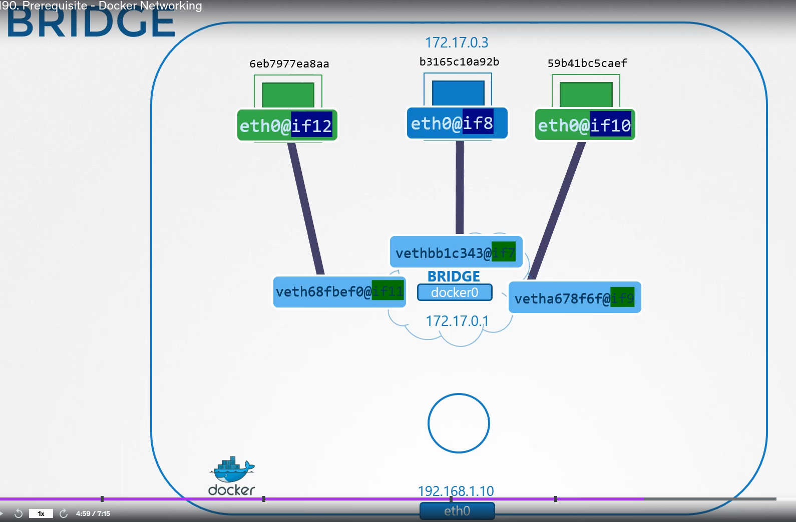

# Pre-requisite Docker Networking <!-- omit in toc -->

  - Take me to [Lecture](https://kodekloud.com/topic/prerequsite-docker-networking/)

In this section, we will take a look at **Docker Networking**

# Contents <!-- omit in toc -->

- [1. Networks](#1-networks)
  - [1.1. None Network](#11-none-network)
  - [1.2. Host Network](#12-host-network)
  - [1.3. Bridge Network](#13-bridge-network)
  - [1.4. List the Docker Network](#14-list-the-docker-network)
  - [1.5. To view the Network Device on the Host](#15-to-view-the-network-device-on-the-host)
  - [1.6. To view the IP Addr of the interface docker0](#16-to-view-the-ip-addr-of-the-interface-docker0)
  - [1.7. Run the command to create a Docker Container](#17-run-the-command-to-create-a-docker-container)
  - [1.8. To list the Network Namespace](#18-to-list-the-network-namespace)
  - [1.9. Port Mapping](#19-port-mapping)
  - [1.10. List the Iptables rules](#110-list-the-iptables-rules)
- [2. References docs](#2-references-docs)

# 1. Networks


The type `bridge` on the `docker network ls` output refers to the name `docker0` on the host.

## 1.1. None Network

- Running docker container with `none` network

```
$ docker run --network none nginx
```

## 1.2. Host Network

- Running docker container with `host` network

```
$ docker run --network host nginx
```

## 1.3. Bridge Network

- Running docker container with `bridge` network

```
$ docker run --network bridge nginx
```

## 1.4. List the Docker Network

```
$ docker network ls
NETWORK ID          NAME                DRIVER              SCOPE
4974cba36c8e        bridge              bridge              local
0e7b30a6c996        host                host                local
a4b19b17d2c5        none                null                local

```

## 1.5. To view the Network Device on the Host  

```
$ ip link
or
$ ip link show docker0
3: docker0: <NO-CARRIER,BROADCAST,MULTICAST,UP> mtu 1500 qdisc noqueue state DOWN mode DEFAULT group default
    link/ether 02:42:cf:c3:df:f5 brd ff:ff:ff:ff:ff:ff
```

- With the help of `ip link add` command to type set `bridge` to `docker0`

```
$ ip link add docker0 type bridge
```

## 1.6. To view the IP Addr of the interface docker0

```
$ ip addr
or
$ ip addr show docker0
3: docker0: <NO-CARRIER,BROADCAST,MULTICAST,UP> mtu 1500 qdisc noqueue state DOWN group default
    link/ether 02:42:cf:c3:df:f5 brd ff:ff:ff:ff:ff:ff
    inet 172.18.0.1/24 brd 172.18.0.255 scope global docker0
       valid_lft forever preferred_lft forever
```

## 1.7. Run the command to create a Docker Container

```
$ docker run nginx
```

## 1.8. To list the Network Namespace

**Note**: `ip netns` will not show the docker namespaces by default. TODO: the lecture mentions some resources to troubleshoot this.

```
$ ip netns
1c452d473e2a (id: 2)
db732004aa9b (id: 1)
04acb487a641 (id: 0)
default

# Inspect the Docker Container

$ docker inspect <container-id>

# To view the interface attached with the local bridge docker0

$ ip link
3: docker0: <BROADCAST,MULTICAST,UP,LOWER_UP> mtu 1500 qdisc noqueue state UP mode DEFAULT group default
    link/ether 02:42:c8:3a:ea:67 brd ff:ff:ff:ff:ff:ff
5: vetha3e33331@if3: <BROADCAST,MULTICAST,UP,LOWER_UP> mtu 1500 qdisc noqueue master docker0 state UP mode DEFAULT group default
    link/ether e2:b2:ad:c9:8b:98 brd ff:ff:ff:ff:ff:ff link-netnsid 0

# with -n options with the network namespace to view the other end of the interface

$ ip -n 04acb487a641 link
1: lo: <LOOPBACK,UP,LOWER_UP> mtu 65536 qdisc noqueue state UNKNOWN mode DEFAULT group default qlen 1000
    link/loopback 00:00:00:00:00:00 brd 00:00:00:00:00:00
3: eth0@if5: <BROADCAST,MULTICAST,UP,LOWER_UP> mtu 1500 qdisc noqueue state UP mode DEFAULT group default
    link/ether c6:f3:ca:12:5e:74 brd ff:ff:ff:ff:ff:ff link-netnsid 0

# To view the IP Addr assigned to this interface 

$ ip -n 04acb487a641 addr
3: eth0@if5: <BROADCAST,MULTICAST,UP,LOWER_UP> mtu 1500 qdisc noqueue state UP group default
    link/ether c6:f3:ca:12:5e:74 brd ff:ff:ff:ff:ff:ff link-netnsid 0
    inet 10.244.0.2/24 scope global eth0
       valid_lft forever preferred_lft forever
```

Every time a new container is created docker creates a namespace, creates a pair of interfaces, and attaches one end to the container and another end to the bridge network.

The interface pairs can be identified using their numbers. Odd and even numbers create a pair. eg: `if7` and `if8` are a pair.



## 1.9. Port Mapping

- Creating a docker container.

```
$ docker run -itd --name nginx nginx
d74ca9d57c1d8983db2c590df2fdd109e07e1972d6b361a6ecad8a942af5bf7e
```

- Inspect the docker container to view the IPAddress.

```
$ docker inspect nginx | grep -w IPAddress
            "IPAddress": "172.18.0.6",
                    "IPAddress": "172.18.0.6",
```

- Accessing web page with the `curl` command.

```
$ curl --head  http://172.18.0.6:80
HTTP/1.1 200 OK
Server: nginx/1.19.2
```

- Port Mapping to docker container

```
$ docker run -itd --name nginx -p 8080:80 nginx
e7387bbb2e2b6cc1d2096a080445a6b83f2faeb30be74c41741fe7891402f6b6
```


- Inspecting docker container to view the assgined ports.

```
$ docker inspect nginx | grep -w -A5 Ports

  "Ports": {
                "80/tcp": [
                    {
                        "HostIp": "0.0.0.0",
                        "HostPort": "8080"
                    }

```
- To view the IP Addr of the host system

```
$ ip a

# Accessing nginx page with curl command

$ curl --head http://192.168.10.11:8080
HTTP/1.1 200 OK
Server: nginx/1.19.2
```

- Configuring **iptables nat** rules

Following is how we would configure port mapping:

```
$ iptables \
         -t nat \
         -A PREROUTING \
         -j DNAT \
         --dport 8080 \
         --to-destination 80
```

Docker does it the same way for mapping ports:

```
$ iptables \
      -t nat \
      -A DOCKER \
      -j DNAT \
      --dport 8080 \
      --to-destination 172.18.0.6:80
```

## 1.10. List the Iptables rules

```
$ iptables -nvL -t nat
```


# 2. References docs

- https://docs.docker.com/network/
- https://linux.die.net/man/8/iptables
- https://linux.die.net/man/8/ip