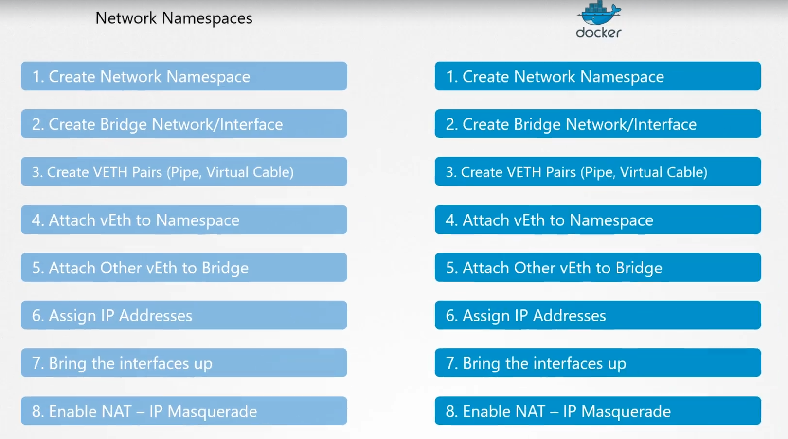
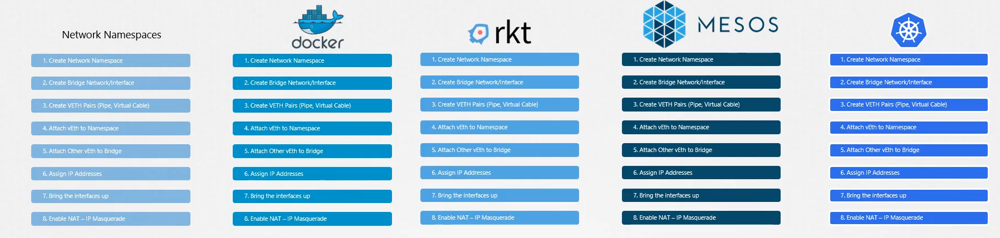
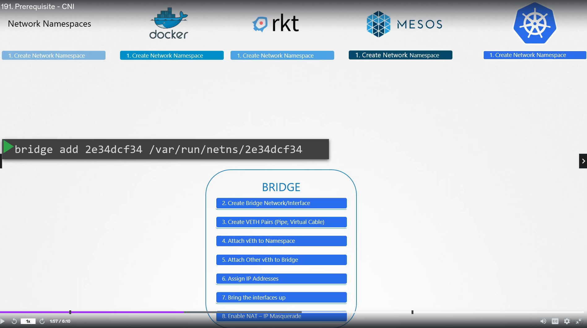
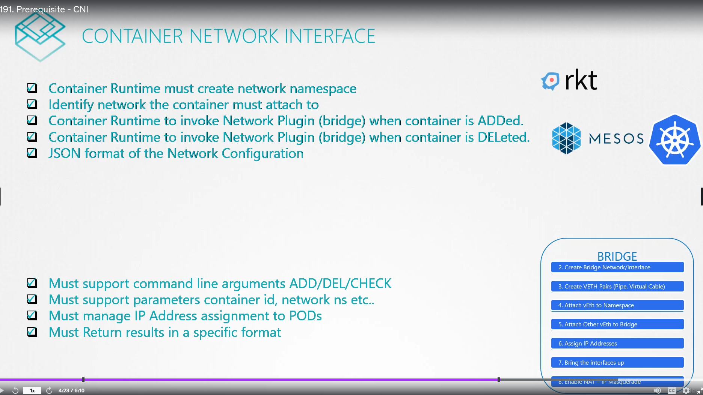

# 1. Pre-requisite CNI <!-- omit in toc -->

  - Take me to [Lecture](https://kodekloud.com/topic/prerequsite-cni/)

In this section, we will take a look at **Pre-requisite Container Network Interface(CNI)**

- [1. Introduction](#1-introduction)
- [2. Third Party Network Plugin Providers](#2-third-party-network-plugin-providers)
- [3. To view the CNI Network Plugins](#3-to-view-the-cni-network-plugins)
- [4. Docker exclusion](#4-docker-exclusion)
- [5. References Docs](#5-references-docs)

# 1. Introduction





Since all the required operations are the same, this can be done by third party tools which are referred to as Bridge.



The CNI standard defines what's needed in a Container Network Interface:




# 2. Third Party Network Plugin Providers

- [Weave](https://www.weave.works/docs/net/latest/kubernetes/kube-addon/#-installation)
- [Calico](https://docs.projectcalico.org/getting-started/kubernetes/quickstart)
- [Flannel](https://github.com/coreos/flannel/blob/master/Documentation/kubernetes.md)
- [Cilium](https://github.com/cilium/cilium)


# 3. To view the CNI Network Plugins

- CNI comes with the set of supported network plugins. 

```
$ ls /opt/cni/bin/
bridge  dhcp  flannel  host-device  host-local  ipvlan  loopback  macvlan  portmap  ptp  sample  tuning  vlan
```

# 4. Docker exclusion

Docker does not adhere to the CNI standard. Docker uses it's own system called Container Network Model (CNM). So you can't run a docker container and specify the network plugin to use is CNI and specify one of the above plugins. (i.e. `This won't work -> $ docker run --network=cni-bridge nginx` won't work). 

But you can still use CNI with Docker if needed. You just have to walk around the CNM. You can do `docker run --network=none nginx` and `bridge add 2e34fsda /var/run/netns/2e34fsda` (replace `2e34fsda` with corresponding container id). This is how Kubernetes does it when running Docker containers.


# 5. References Docs

- https://kubernetes.io/docs/concepts/extend-kubernetes/compute-storage-net/network-plugins/


