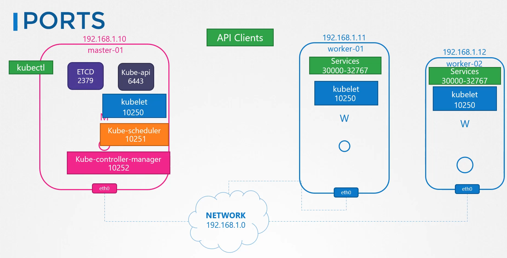
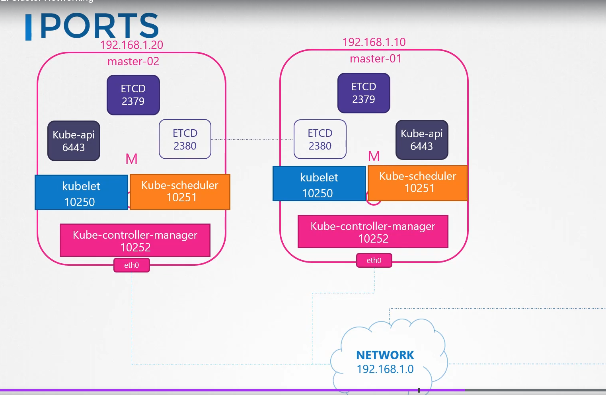

# Pre-requisite Cluster Networking <!-- omit in toc -->

  - Take me to [Lecture](https://kodekloud.com/topic/cluster-networking/)

In this section, we will take a look at **Pre-requisite of the Cluster Networking**

- Set the unique hostname.
- Get the IP addr of the system (master and worker node).
- Check the Ports.

- [1. Introduction](#1-introduction)
- [2. IP and Hostname](#2-ip-and-hostname)
- [3. Set the hostname](#3-set-the-hostname)
- [4. View the Listening Ports of the system](#4-view-the-listening-ports-of-the-system)
- [5. References Docs](#5-references-docs)

# 1. Introduction

The Kubernetes cluster consists of master and worker nodes. 

Each node must have:
- at least 1 interface connected to the network. 
- Each interface must have an address configured. 
- The hosts must have a unique hostname set as well as a unique MAC address.

There are some ports that need to be opened as well:

- The master should accept connections on port `6443` for `kube-api` server.
- The Kubelets on the master and worker nodes listen on port `10250`
- The kube-scheduler requires port `10251` to be open.
- The Kube-controller manager requires `10252` to be open.
- The worker nodes expose services for external access on ports `30000` to `32767`, so these need to be open as well.
- ETCD server listens on port `2379`
[[REF](https://kubernetes.io/docs/reference/ports-and-protocols/)]



If you have multiple masters, port `2380` need to be open as well so that the ETCD clients can communicate with each other.



# 2. IP and Hostname

- To view the hostname

```
$ hostname 
```

- To view the IP addr of the system

```
$ ip a
```


# 3. Set the hostname

```
$ hostnamectl set-hostname <host-name>

$ exec bash
```

# 4. View the Listening Ports of the system

```
$ netstat -nltp
```


# 5. References Docs

- https://kubernetes.io/docs/setup/production-environment/tools/kubeadm/install-kubeadm/#check-required-ports
- https://kubernetes.io/docs/concepts/cluster-administration/networking/